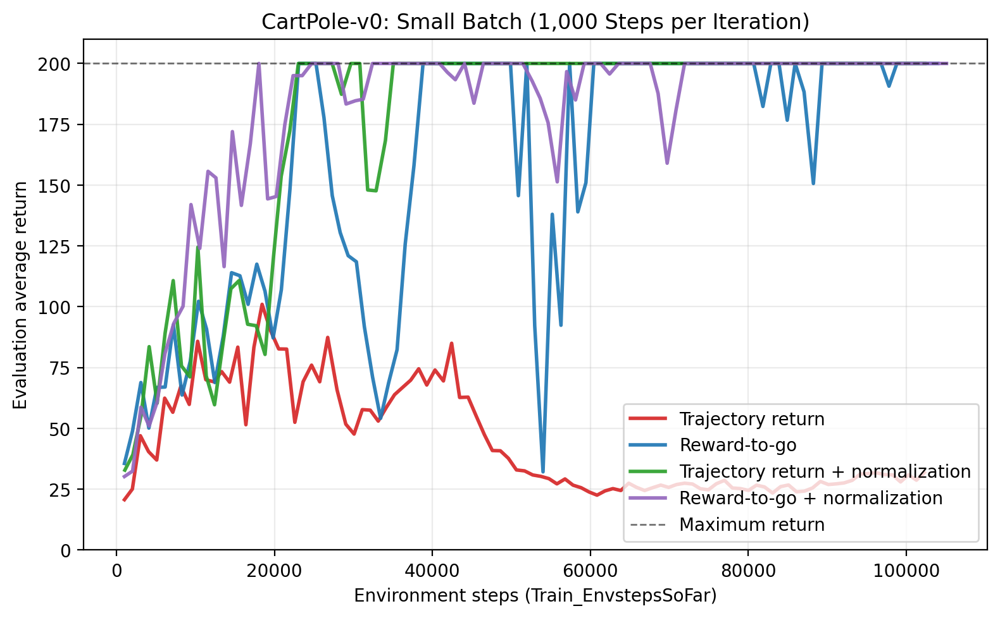
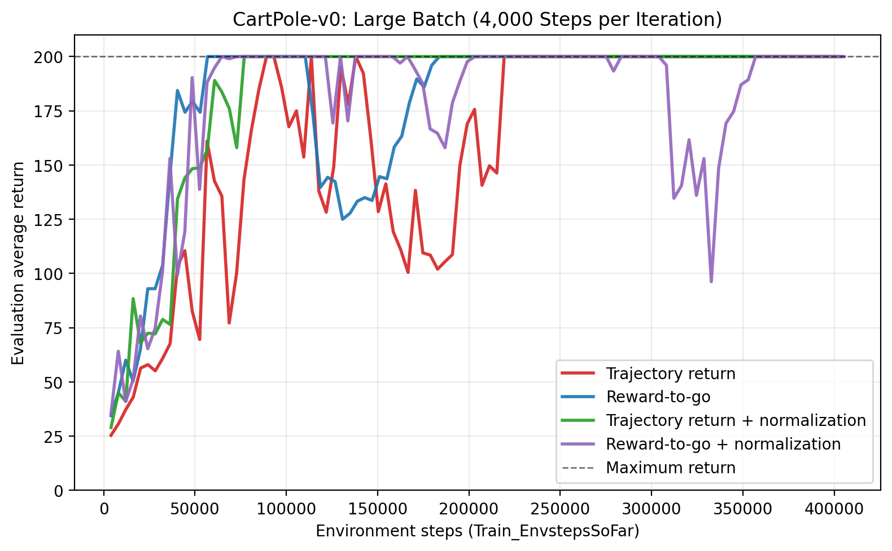
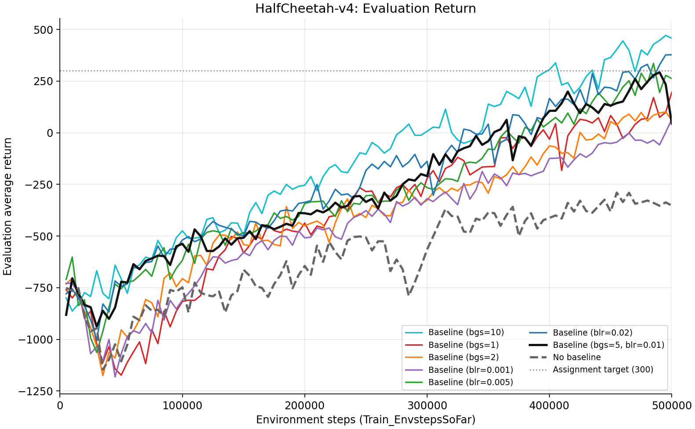
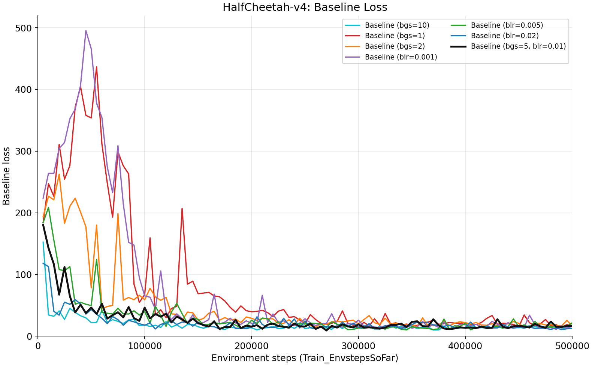
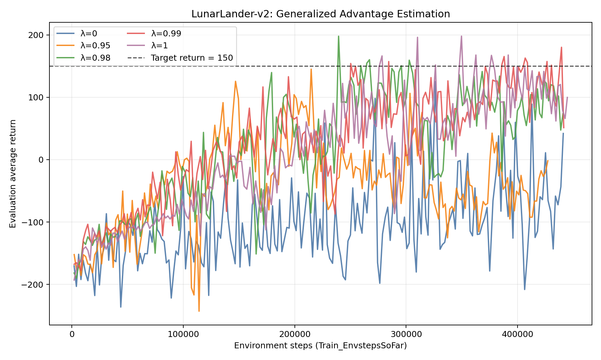
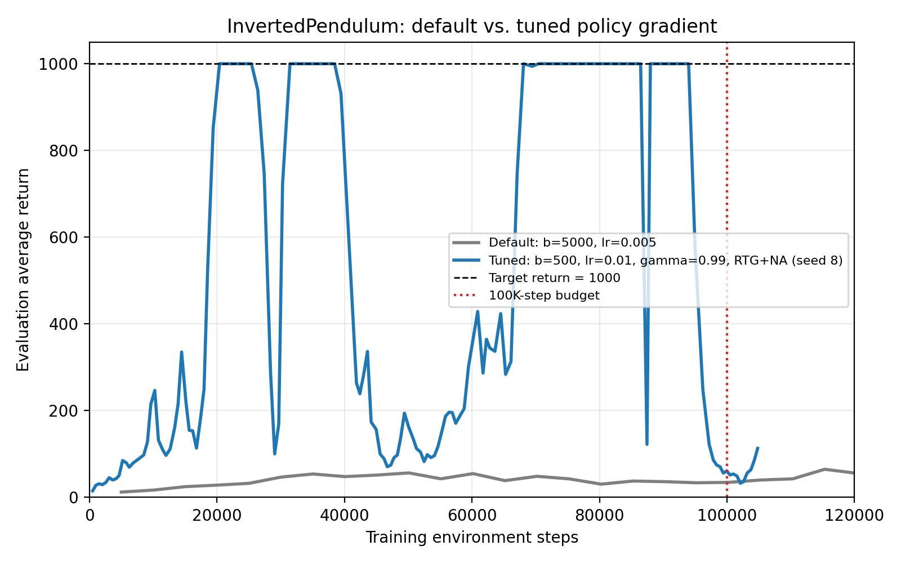
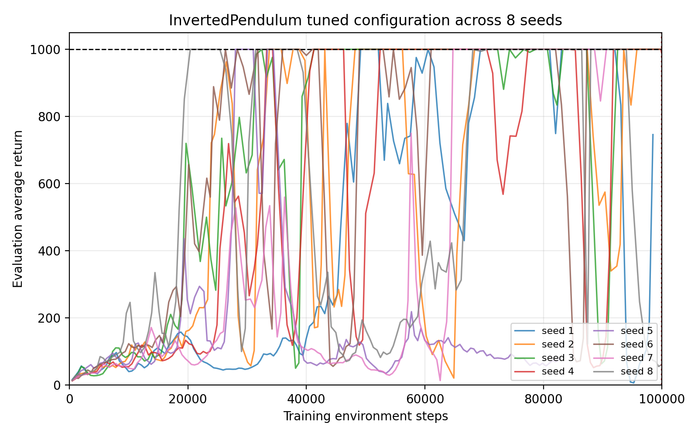

# HW2 Report: Policy Gradients

## Experiment 1: CartPole

### Experimental setup

I evaluated four policy-gradient variants on `CartPole-v0` with two batch sizes. The variants differ in whether they use reward-to-go (RTG) and whether they normalize the estimated advantages within each batch. All experiments used 100 policy-gradient iterations and seed 1. Unless shown below, the default hyperparameters were used: discount factor 1.0, learning rate 0.005, two hidden layers, and hidden-layer size 64.

The eight experiments completed successfully and each produced 100 logged evaluation points. CartPole-v0 has a maximum episode return of 200.

### Exact commands

The experiments were assigned to eight physical GPUs with `CUDA_VISIBLE_DEVICES`. Each process therefore saw its assigned physical GPU as `cuda:0`.

```bash
CUDA_VISIBLE_DEVICES=0 uv run src/scripts/run.py \
  --env_name CartPole-v0 -n 100 -b 1000 \
  --exp_name cartpole

CUDA_VISIBLE_DEVICES=1 uv run src/scripts/run.py \
  --env_name CartPole-v0 -n 100 -b 1000 \
  -rtg --exp_name cartpole_rtg

CUDA_VISIBLE_DEVICES=2 uv run src/scripts/run.py \
  --env_name CartPole-v0 -n 100 -b 1000 \
  -na --exp_name cartpole_na

CUDA_VISIBLE_DEVICES=3 uv run src/scripts/run.py \
  --env_name CartPole-v0 -n 100 -b 1000 \
  -rtg -na --exp_name cartpole_rtg_na

CUDA_VISIBLE_DEVICES=4 uv run src/scripts/run.py \
  --env_name CartPole-v0 -n 100 -b 4000 \
  --exp_name cartpole_lb

CUDA_VISIBLE_DEVICES=5 uv run src/scripts/run.py \
  --env_name CartPole-v0 -n 100 -b 4000 \
  -rtg --exp_name cartpole_lb_rtg

CUDA_VISIBLE_DEVICES=6 uv run src/scripts/run.py \
  --env_name CartPole-v0 -n 100 -b 4000 \
  -na --exp_name cartpole_lb_na

CUDA_VISIBLE_DEVICES=7 uv run src/scripts/run.py \
  --env_name CartPole-v0 -n 100 -b 4000 \
  -rtg -na --exp_name cartpole_lb_rtg_na
```

### Learning curves

The horizontal axis in both figures is the cumulative number of environment steps (`Train_EnvstepsSoFar`), as required by the assignment. The vertical axis is `Eval_AverageReturn`.

#### Small batch: 1,000 environment steps per iteration



#### Large batch: 4,000 environment steps per iteration



### Quantitative results

“First >=195” is the first evaluation checkpoint with average return at least 195. “Stable >=195” is the first iteration after which every remaining evaluation checkpoint stays at or above 195. “Mean eval return” is the mean of all 100 logged evaluation returns and serves as a summary of the entire learning curve.

| Experiment | Batch size | RTG | Advantage normalization | First >=195 (iteration / env steps) | Stable >=195 from iteration | Final-10 mean | Mean eval return |
|---|---:|:---:|:---:|---:|---:|---:|---:|
| `cartpole` | 1,000 | No | No | Not reached | Not reached | 30.45 | 44.44 |
| `cartpole_rtg` | 1,000 | Yes | No | 21 / 23,066 | 94 | 199.07 | 158.40 |
| `cartpole_na` | 1,000 | No | Yes | 21 / 23,024 | 32 | 200.00 | 175.39 |
| `cartpole_rtg_na` | 1,000 | Yes | Yes | **16 / 18,029** | 66 | 200.00 | **180.70** |
| `cartpole_lb` | 4,000 | No | No | 21 / 89,158 | 53 | 200.00 | 161.41 |
| `cartpole_lb_rtg` | 4,000 | Yes | No | **13 / 56,840** | 43 | 200.00 | 180.18 |
| `cartpole_lb_na` | 4,000 | No | Yes | 18 / 76,962 | **18** | 200.00 | **184.11** |
| `cartpole_lb_rtg_na` | 4,000 | Yes | Yes | 15 / 64,720 | 87 | 200.00 | 178.48 |

### Discussion

#### Which value estimator performed better without advantage normalization?

Reward-to-go performed better than the trajectory-centric estimator when advantage normalization was disabled. In the small-batch experiments, the trajectory-centric `cartpole` run failed to converge and had a mean evaluation return of only 44.44, whereas `cartpole_rtg` eventually reached the maximum return and had a mean evaluation return of 158.40. The same pattern appeared with the large batch: `cartpole_lb_rtg` reached an average return of 195 after about 56,840 environment steps, compared with 89,158 steps for `cartpole_lb`, and its overall mean evaluation return was higher (180.18 versus 161.41).

#### Why is reward-to-go generally preferred?

The trajectory-centric estimator assigns the same full-trajectory return to every action in the trajectory. This return includes rewards received before a particular action was taken, even though that action could not have caused those earlier rewards. These irrelevant past rewards add variance to the policy-gradient estimate and make temporal credit assignment more difficult.

Reward-to-go uses only rewards at and after the current time step. By exploiting causality, it removes rewards that the current action cannot influence while preserving an unbiased policy-gradient estimate. It is therefore generally preferred because it provides a lower-variance and more informative learning signal.

#### Did advantage normalization help?

Yes. Its effect was especially strong for the trajectory-centric estimator. With a batch size of 1,000, the unnormalized `cartpole` run never solved the task, while `cartpole_na` reached an average return of 195 at iteration 21 and remained above 195 from iteration 32 onward. With a batch size of 4,000, `cartpole_lb_na` was the strongest overall run: it had the highest mean evaluation return (184.11), reached stable performance at iteration 18, and obtained a return of 200 at every checkpoint in the final 50 iterations.

Normalization was not uniformly beneficial at every point in every run. In particular, `cartpole_lb_rtg_na` experienced several later regressions and had a slightly lower mean evaluation return than `cartpole_lb_rtg`. Nevertheless, the results show that normalization greatly improves robustness when return magnitudes vary and prevents the severe failure observed in the small-batch trajectory-centric experiment.

#### Did batch size make an impact?

Yes. A larger batch reduces the sampling variance of each gradient estimate and improved the robustness of the otherwise unstable trajectory-centric estimator: `cartpole_lb` eventually solved the task, while the corresponding small-batch `cartpole` run did not. Large-batch configurations also tended to reach high returns in fewer policy-gradient iterations.

However, each large-batch iteration used approximately four times as many environment interactions. When performance is plotted against environment steps rather than iterations, the successful small-batch configurations are more sample-efficient. For example, `cartpole_rtg_na` first reached an average return of 195 after about 18,029 environment steps, whereas the fastest large-batch configuration, `cartpole_lb_rtg`, required about 56,840 steps. Thus, the large batch provided lower-variance updates and greater robustness, but at a substantial sample and wall-clock cost.

### Conclusion

The experiments demonstrate that variance reduction is essential for policy-gradient training. Reward-to-go clearly outperformed the trajectory-centric estimator when advantages were not normalized, supporting the standard causality-based argument for using reward-to-go. Advantage normalization produced the largest improvement, especially for the small-batch trajectory-centric estimator. The best overall and most stable configuration was `cartpole_lb_na`, while `cartpole_rtg_na` was the most sample-efficient configuration according to the first checkpoint at which the evaluation return reached 195.

These conclusions are based on one random seed, as specified by the experiment commands. Multiple seeds would be required to determine whether smaller differences, such as the difference between the two successful large-batch RTG configurations, are statistically reliable.


## Experiment 2: HalfCheetah

### Experimental setup

I trained a policy-gradient agent on `HalfCheetah-v4` for 100 iterations. Every run used reward-to-go, batch size 5,000, evaluation batch size 3,000, discount factor 0.95, policy learning rate 0.01, a two-layer MLP with 64 units per layer, and seed 1. Advantage normalization was not enabled, as required by the assignment. The baseline runs used a state-dependent value network; the no-baseline run did not. Each evaluation point is plotted against `Train_EnvstepsSoFar`.

### Exact commands

The following are the exact configurations represented by the eight logs. `CUDA_VISIBLE_DEVICES=0` is optional; when used, the process sees the selected physical GPU as `cuda:0`.

```bash
CUDA_VISIBLE_DEVICES=0 uv run src/scripts/run.py \
  --env_name HalfCheetah-v4 -n 100 -b 5000 -eb 3000 -rtg \
  --discount 0.95 -lr 0.01 --exp_name cheetah

CUDA_VISIBLE_DEVICES=0 uv run src/scripts/run.py \
  --env_name HalfCheetah-v4 -n 100 -b 5000 -eb 3000 -rtg \
  --discount 0.95 -lr 0.01 --use_baseline -blr 0.01 -bgs 5 \
  --exp_name cheetah_baseline

CUDA_VISIBLE_DEVICES=0 uv run src/scripts/run.py \
  --env_name HalfCheetah-v4 -n 100 -b 5000 -eb 3000 -rtg \
  --discount 0.95 -lr 0.01 --use_baseline -blr 0.01 -bgs 1 \
  --exp_name cheetah_baseline_bgs1_blr001

CUDA_VISIBLE_DEVICES=0 uv run src/scripts/run.py \
  --env_name HalfCheetah-v4 -n 100 -b 5000 -eb 3000 -rtg \
  --discount 0.95 -lr 0.01 --use_baseline -blr 0.01 -bgs 2 \
  --exp_name cheetah_baseline_bgs2_blr001

CUDA_VISIBLE_DEVICES=0 uv run src/scripts/run.py \
  --env_name HalfCheetah-v4 -n 100 -b 5000 -eb 3000 -rtg \
  --discount 0.95 -lr 0.01 --use_baseline -blr 0.001 -bgs 5 \
  --exp_name cheetah_baseline_bgs5_blr0001

CUDA_VISIBLE_DEVICES=0 uv run src/scripts/run.py \
  --env_name HalfCheetah-v4 -n 100 -b 5000 -eb 3000 -rtg \
  --discount 0.95 -lr 0.01 --use_baseline -blr 0.005 -bgs 5 \
  --exp_name cheetah_baseline_bgs5_blr0005

CUDA_VISIBLE_DEVICES=0 uv run src/scripts/run.py \
  --env_name HalfCheetah-v4 -n 100 -b 5000 -eb 3000 -rtg \
  --discount 0.95 -lr 0.01 --use_baseline -blr 0.02 -bgs 5 \
  --exp_name cheetah_baseline_bgs5_blr002

CUDA_VISIBLE_DEVICES=0 uv run src/scripts/run.py \
  --env_name HalfCheetah-v4 -n 100 -b 5000 -eb 3000 -rtg \
  --discount 0.95 -lr 0.01 --use_baseline -blr 0.01 -bgs 10 \
  --exp_name cheetah_baseline_bgs10_blr001
```

### Learning curves

The first plot compares the evaluation returns for the no-baseline run, the assignment's standard baseline configuration, and the additional baseline hyperparameter sweeps. The dotted horizontal line marks the assignment's target of 300.



The second plot shows the value-network training loss. The no-baseline run has no baseline-loss column and is therefore omitted from this plot.



### Quantitative results

“Final” is the evaluation return at 500,000 environment steps. “Final-10 mean” averages the last ten evaluation points. “Best” is the maximum evaluation return observed during training, and “First >=300” is the first logged iteration at which the evaluation return reached 300 or higher.

| Experiment | Baseline learning rate | Baseline gradient steps | Final return | Final-10 mean | Best return | First >=300 (iteration / env steps) | Final baseline loss |
|---|---:|---:|---:|---:|---:|---:|---:|
| `cheetah` (no baseline) | -- | -- | -352.29 | -330.60 | -289.56 | Not reached | -- |
| `cheetah_baseline` | 0.010 | 5 | 44.11 | 206.38 | 292.34 | Not reached | 16.93 |
| `cheetah_baseline_bgs1_blr001` | 0.010 | 1 | 196.63 | 72.89 | 196.63 | Not reached | 15.75 |
| `cheetah_baseline_bgs2_blr001` | 0.010 | 2 | 60.64 | 75.39 | 101.04 | Not reached | 15.98 |
| `cheetah_baseline_bgs5_blr0001` | 0.001 | 5 | 66.08 | -21.77 | 66.08 | Not reached | 15.84 |
| `cheetah_baseline_bgs5_blr0005` | 0.005 | 5 | 262.30 | 242.53 | 335.97 | 96 / 485,000 | 21.61 |
| `cheetah_baseline_bgs5_blr002` | 0.020 | 5 | 377.45 | 304.71 | 377.45 | 94 / 475,000 | 12.28 |
| `cheetah_baseline_bgs10_blr001` | 0.010 | 10 | **457.28** | **412.38** | **471.27** | 79 / 400,000 | 12.11 |

### Discussion

The no-baseline policy failed to learn: its evaluation return stayed negative and ended at -352.29. Adding the standard neural-network baseline substantially improved learning, with a best return of 292.34 and a final-10 mean of 206.38, although this particular seed did not reach the required 300 threshold. The strongest run was `bgs=10`, which reached 300 at iteration 79 (400,000 environment steps), ended at 457.28, and had a final-10 mean of 412.38. Increasing the baseline update steps therefore helped this run fit the value function sufficiently well to produce a more useful advantage estimate.

For the requested reduced-update experiment, decreasing `bgs` from 5 to 1 or 2 made the policy much worse. The `bgs=1` run ended at 196.63 and the `bgs=2` run at 60.64; neither reached 300. Their baseline losses still decreased to about 16, so a decreasing loss by itself did not guarantee a good policy. Fewer baseline updates likely left the value estimate less accurate early in training, increasing the variance or bias of the policy update even though the eventual supervised loss was small.

Reducing the baseline learning rate had a similar negative effect. With `blr=0.001`, the final return was only 66.08 and the last-ten mean was -21.77. The intermediate `blr=0.005` run learned substantially better (best return 335.97), but its final return fell to 262.30, showing instability late in training. In contrast, increasing `blr` to 0.02 produced a final return of 377.45 and a final-10 mean of 304.71. These comparisons indicate that both the number of baseline optimization steps and the baseline learning rate affect the quality and timing of the advantage estimates.

Overall, the neural-network baseline was clearly beneficial relative to no baseline, but its performance was sensitive to optimization hyperparameters. The baseline-loss plot shows that most runs eventually reduce the value-function loss, while the evaluation-return plot shows that only some runs convert that reduction into sustained control performance. This is consistent with the baseline being useful only insofar as it tracks the policy's changing return distribution during the policy updates.


## Experiment 3: Generalized Advantage Estimation

### Experimental setup

I trained policy-gradient agents on `LunarLander-v2` using generalized advantage estimation with `lambda` in `{0, 0.95, 0.98, 0.99, 1}`. Every run used 200 policy-gradient iterations, a training batch size of 2,000 transitions, an evaluation batch size of 2,000 transitions, a discount factor of 0.99, reward-to-go, a neural-network baseline, three hidden layers with 128 units per layer, a policy learning rate of 0.001, a maximum episode length of 1,000, and seed 1. No other algorithm hyperparameters were changed.

The five experiments completed successfully and each produced 200 evaluation points. The runs were assigned to separate physical GPUs. `UV_PROJECT_ENVIRONMENT` only selected a local mirror of the environment described by `uv.lock`; it did not change the experiment configuration.

### Exact commands

```bash
CUDA_VISIBLE_DEVICES=0 UV_PROJECT_ENVIRONMENT=/tmp/cs285hw2-venv /opt/conda/bin/uv run src/scripts/run.py --env_name LunarLander-v2 --ep_len 1000 --discount 0.99 -n 200 -b 2000 -eb 2000 -l 3 -s 128 -lr 0.001 --use_reward_to_go --use_baseline --gae_lambda 0 --exp_name lunar_lander_lambda0

CUDA_VISIBLE_DEVICES=1 UV_PROJECT_ENVIRONMENT=/tmp/cs285hw2-venv /opt/conda/bin/uv run src/scripts/run.py --env_name LunarLander-v2 --ep_len 1000 --discount 0.99 -n 200 -b 2000 -eb 2000 -l 3 -s 128 -lr 0.001 --use_reward_to_go --use_baseline --gae_lambda 0.95 --exp_name lunar_lander_lambda0.95

CUDA_VISIBLE_DEVICES=2 UV_PROJECT_ENVIRONMENT=/tmp/cs285hw2-venv /opt/conda/bin/uv run src/scripts/run.py --env_name LunarLander-v2 --ep_len 1000 --discount 0.99 -n 200 -b 2000 -eb 2000 -l 3 -s 128 -lr 0.001 --use_reward_to_go --use_baseline --gae_lambda 0.98 --exp_name lunar_lander_lambda0.98

CUDA_VISIBLE_DEVICES=3 UV_PROJECT_ENVIRONMENT=/tmp/cs285hw2-venv /opt/conda/bin/uv run src/scripts/run.py --env_name LunarLander-v2 --ep_len 1000 --discount 0.99 -n 200 -b 2000 -eb 2000 -l 3 -s 128 -lr 0.001 --use_reward_to_go --use_baseline --gae_lambda 0.99 --exp_name lunar_lander_lambda0.99

CUDA_VISIBLE_DEVICES=4 UV_PROJECT_ENVIRONMENT=/tmp/cs285hw2-venv /opt/conda/bin/uv run src/scripts/run.py --env_name LunarLander-v2 --ep_len 1000 --discount 0.99 -n 200 -b 2000 -eb 2000 -l 3 -s 128 -lr 0.001 --use_reward_to_go --use_baseline --gae_lambda 1 --exp_name lunar_lander_lambda1
```

### Learning curves

The horizontal axis is the cumulative number of environment steps (`Train_EnvstepsSoFar`), and the vertical axis is `Eval_AverageReturn`. The dashed line marks the assignment target of 150.



### Quantitative results

`Best` is the maximum evaluation average return observed during training. Because the evaluation batch contains only 2,000 transitions and successful policies often produce episodes close to the 1,000-step limit, a late evaluation point may contain only two episodes. The final value is therefore noisy, so I also report the mean over the last ten evaluation points.

| GAE lambda | Final return | Final-10 mean | Best return | Best (iteration / env steps) | First >=150 (iteration / env steps) |
|---:|---:|---:|---:|---:|---:|
| 0 | 41.95 | -53.66 | 125.21 | 148 / 326,171 | Not reached |
| 0.95 | -1.87 | -46.93 | 145.03 | 95 / 214,795 | Not reached |
| 0.98 | 73.70 | 96.43 | 197.85 | 108 / 239,387 | **108 / 239,387** |
| 0.99 | 51.26 | **121.06** | 180.12 | 198 / 439,464 | 111 / 250,270 |
| 1 | **99.72** | 93.97 | **197.94** | 157 / 349,692 | 126 / 278,387 |

### Effect of lambda

The one-step estimator (`lambda=0`) learned slowly and never reached the target return of 150. Increasing `lambda` generally produced a stronger learning signal: `lambda=0.98`, `0.99`, and `1` all exceeded 150 at least once. Among them, `lambda=0.98` reached the threshold first, at iteration 108 and 239,387 environment steps. Its best return of 197.85 was essentially tied with the highest observed return, 197.94 for `lambda=1`.

The curves were not monotonic. All successful high-`lambda` runs showed substantial regressions after strong checkpoints, and `lambda=0.99` had the best final-10 mean even though its final checkpoint fell to 51.26. This is consistent with the evaluation estimate being noisy and with larger `lambda` placing more weight on longer-horizon returns. The `lambda=0.95` run also illustrates the variance across a single seed: it improved to 145.03 but did not cross 150.

### Interpretation of the endpoints

`lambda=0` reduces GAE to the one-step temporal-difference advantage,
`r_t + gamma V(s_{t+1}) - V(s_t)`. It has relatively low variance but can have high bias when the learned value function is inaccurate. In this experiment it produced the weakest peak among the tested settings.

`lambda=1` reduces the finite-horizon recursion to the Monte Carlo advantage (the discounted return minus the value baseline). This reduces bootstrapping bias but increases variance. It achieved the highest single return in this run, but its curve remained variable and did not dominate the intermediate values throughout training. Overall, `lambda=0.98` provided the best sample-efficiency/peak-performance balance for this seed, while `lambda=0.99` had the strongest late-training average.

## Experiment 4: Hyperparameters and Sample Efficiency

### Experimental setup

I tuned policy gradient on `InvertedPendulum-v4` to reach the maximum return of 1,000 within 100,000 training environment steps. After a coarse search over algorithmic switches, batch size, learning rate, and discount factor, I refined the best region and evaluated the selected configuration using eight random seeds. The final validation used `eval_batch_size=5000`, so an average return of 1,000 represents at least five complete successful evaluation episodes.

### Best hyperparameters

| Hyperparameter | Value |
|---|---:|
| Training / evaluation batch size | 500 / 5,000 |
| Policy learning rate | 0.01 |
| Discount factor | 0.99 |
| Reward-to-go / advantage normalization | True / True |
| Baseline / GAE | Disabled |
| Hidden layers / size | 2 / 64 |

### Exact commands

Default:

```bash
CUDA_VISIBLE_DEVICES=0 UV_PROJECT_ENVIRONMENT=/tmp/cs285hw2-venv /opt/conda/bin/uv run src/scripts/run.py --env_name InvertedPendulum-v4 -n 100 -b 5000 -eb 1000 -gpu_id 0 --seed 1 --exp_name pendulum_default_full
```

Best run:

```bash
CUDA_VISIBLE_DEVICES=7 UV_PROJECT_ENVIRONMENT=/tmp/cs285hw2-venv /opt/conda/bin/uv run src/scripts/run.py --env_name InvertedPendulum-v4 -n 140 -b 500 -eb 5000 -rtg -na --discount 0.99 -lr 0.01 -l 2 -s 64 -gpu_id 0 --seed 8 --exp_name pendulum_final_b500_lr01_g099_seedcheck
```

### Learning curves





### Results

`First 1000` is the first logged `Train_EnvstepsSoFar` at which `Eval_AverageReturn` reached 1,000 at or below the 100K-step budget.

| Seed | First 1000 (env steps) |
|---:|---:|
| 1 | 49,153 |
| 2 | 33,757 |
| 3 | 32,495 |
| 4 | 33,308 |
| 5 | 28,035 |
| 6 | 26,344 |
| 7 | 64,732 |
| 8 | **20,412** |

All eight seeds reached the target within 100K training steps, with a median first-hit count of approximately 32,902 steps. The complete default run did not reach 1,000 even after 505,089 training steps; its best evaluation average return within the first 100K steps was 56.42 and its final return was 58.22.

Batch size mattered most because this implementation performs one actor update per collected batch. Reducing the requested batch size from 5,000 to 500 provided many more policy updates per training transition. Advantage normalization was also essential: reward-to-go without normalization did not reach the target in the coarse search, while combining reward-to-go and normalization consistently produced successful configurations.

The useful learning-rate range was approximately `0.008` to `0.012`. A rate of `0.003` learned too slowly and `0.03` was unstable, while `0.01` was fastest with batch size 500. Discount `0.99` learned faster than `1.0`; nearby values `0.98` and `0.995` also worked but reached the target later. The default two-layer 64-unit network was sufficient, and a learned baseline or GAE was unnecessary once reward-to-go and advantage normalization were enabled. The curves remain non-monotonic because vanilla on-policy policy-gradient updates can degrade a previously successful policy, but every validation seed satisfied the required sample-efficiency threshold.
