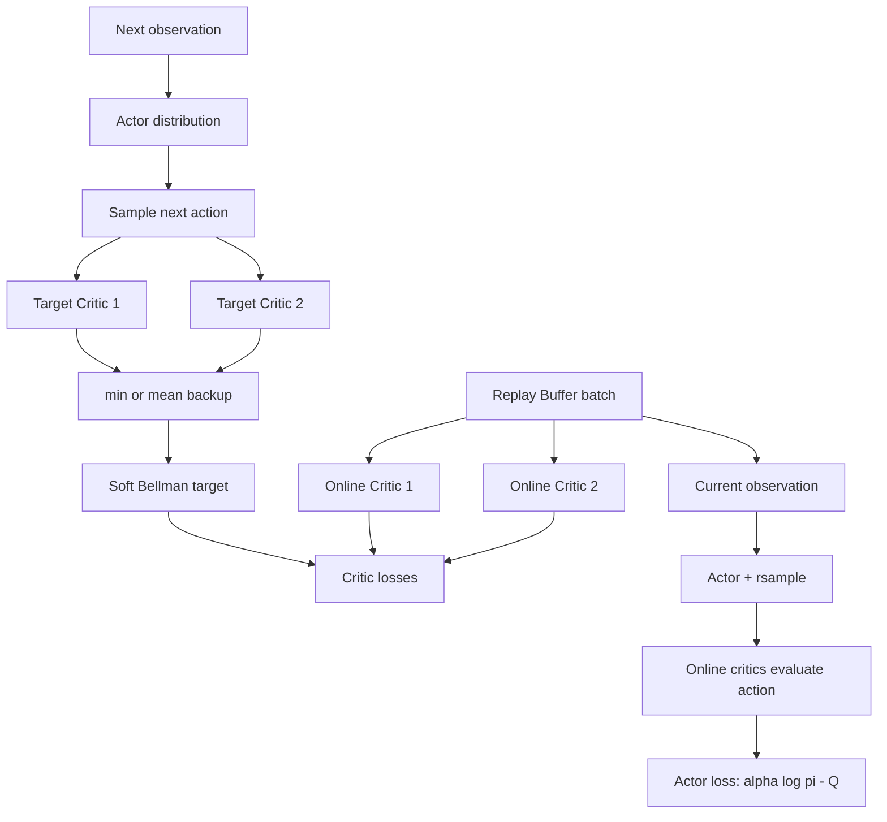

# CS285 HW3 作业笔记：DQN、SAC、PyTorch 与实验实践

这份笔记整理 HW3 中使用的强化学习算法、代码结构、PyTorch 基础、常见错误和实验结论。官方要求见 [hw3.pdf](hw3.pdf)，实验报告见 [HW3_REPORT_CN.md](HW3_REPORT_CN.md)。

## 1. HW3 任务地图

HW3 包含两条主线：

- DQN：面向离散动作空间，网络输出每个动作的 Q 值。
- SAC：面向连续动作空间，同时训练随机 Actor 和状态动作 critic。

主要文件：

| 文件 | 作用 |
|---|---|
| `src/agents/dqn_agent.py` | DQN 动作选择、critic 更新、target network、Double DQN |
| `src/scripts/run_dqn.py` | DQN 环境交互、replay buffer 与训练循环 |
| `src/agents/sac_agent.py` | SAC critic、Actor、熵、重参数化、自动温度、clipped double-Q |
| `src/scripts/run_sac.py` | SAC 环境交互与训练循环 |
| `src/infrastructure/replay_buffer.py` | 普通和图像内存高效 replay buffer |
| `src/configs/schedule.py` | ε 与其他数值的时间调度 |
| `src/networks/critics.py` | DQN critic 与 SAC state-action critic |
| `src/networks/policies.py` | 随机策略及其动作分布 |
| `src/infrastructure/distributions.py` | Gaussian、tanh transform 等分布工具 |

## 2. DQN 整体架构

### 2.1 为什么需要 DQN

Q-learning 希望学习：

$$
Q^*(s,a)=\max_\pi\mathbb E\left[\sum_{k=0}^{\infty}\gamma^k r_{t+k}\mid s_t=s,a_t=a\right].
$$

表格 Q-learning 无法处理高维或连续状态，因此 DQN 使用神经网络近似：

$$
Q_\phi(s,a)\approx Q^*(s,a).
$$

对于离散动作，DQN 网络输入状态，输出所有动作的 Q 值：

```text
输入：  observation，shape = (batch_size, observation_dim)
输出：  qa_values，shape = (batch_size, num_actions)
```

### 2.2 训练数据流

```mermaid
flowchart LR
    S[状态 s] --> P[epsilon-greedy]
    P --> A[动作 a]
    A --> E[环境]
    E --> T[transition: s,a,r,s',done]
    T --> R[Replay Buffer]
    R --> B[随机采样 batch]
    B --> O[Online Q 网络预测 Q(s,a)]
    B --> G[Target Q 网络计算 Bellman target]
    O --> L[MSE loss]
    G --> L
    L --> U[更新 Online Q]
    U --> C[定期复制到 Target Q]
```

每条 transition 为：

$$
(s_t,a_t,r_t,s_{t+1},d_t).
$$

标准 DQN target：

$$
y_t=r_t+\gamma(1-d_t)\max_{a'}Q_{\phi'}(s_{t+1},a').
$$

当前网络预测 replay buffer 中实际执行动作的价值：

$$
\hat q_t=Q_\phi(s_t,a_t).
$$

损失：

$$
L_Q=\mathbb E[(\hat q_t-y_t)^2].
$$

### 2.3 Online Q 与 Target Q

Online Q 每次梯度更新都会变化；如果它同时生成预测和监督目标，目标会持续移动，训练容易振荡。Target Q 是 Online Q 的延迟副本：

$$
\phi'\leftarrow\phi
$$

但只每隔 `target_update_period` 执行一次。这样 target 在若干步内保持固定。

### 2.4 ε-greedy

环境交互时：

```text
以概率 epsilon：随机动作
否则：argmax_a Q(s,a)
```

ε 只用于收集训练数据。计算 Bellman target 时不使用 ε，而是执行贪心选择。否则学习目标将不再是标准 Q-learning 最优 target。

训练早期 ε 大，用于探索；后期 ε 小，更多使用当前策略。`PiecewiseSchedule` 或 `LinearSchedule` 根据环境步数输出 ε。

### 2.5 `qa_values` 与 `q_values`

若 batch size 为 $B$，动作数为 $A$：

```text
qa_values.shape = (B, A)  # 每个状态下所有动作的 Q 值
q_values.shape  = (B,)    # 每个状态实际动作对应的 Q 值
```

`argmax(dim=1)` 返回每行最大动作索引，形状为 `(B,)`。使用 `gather` 时需要把索引变为 `(B,1)`：

```text
next_action:                 (B,)
next_action.unsqueeze(1):    (B,1)
gather 后：                  (B,1)
squeeze(1) 后：              (B,)
```

不要直接写 `qa_values[action]`，因为那会选择行，而不是为 batch 中每一行选择对应动作列。

### 2.6 Double DQN

普通 DQN 使用 target network 同时选择和评价动作，最大化操作容易偏向被高估的动作。Double DQN 改为：

$$
a^*=\arg\max_a Q_\phi(s',a),
$$

$$
y=r+\gamma(1-d)Q_{\phi'}(s',a^*).
$$

可以记成：

```text
Online Q：选择动作
Target Q：评价动作
```

### 2.7 Replay Buffer

普通 `ReplayBuffer` 完整保存：

```text
observations
actions
rewards
next_observations
dones
```

返回字典字段是复数形式，训练脚本必须使用完全一致的键名。

#### 图像状态为什么会重复

Atari 状态通常由最近四帧组成：

```text
s_t     = [f1, f2, f3, f4]
s_(t+1) =     [f2, f3, f4, f5]
```

两个相邻状态共享三张完全相同的历史帧。普通 buffer 为一条 transition 保存八张帧，其中大量重复。

`MemoryEfficientReplayBuffer` 只保存单独的原始帧，并记录组成 observation 的帧索引：

```text
framebuffer = [f1, f2, f3, f4, f5]
obs indices      = [0,1,2,3]
next obs indices = [1,2,3,4]
```

新 episode 开始时不能使用上一个 episode 的历史帧，因此 `_compute_frame_history_idcs()` 会把越过 episode 起点的索引裁到第一帧：

```text
第一步：[f0,f0,f0,f0]
第二步：[f0,f0,f0,f1]
第三步：[f0,f0,f1,f2]
```

### 2.8 DQN 稳定化细节

- Replay buffer：降低连续样本相关性，提高数据利用率。
- Target network：稳定 bootstrap target。
- Double DQN：降低过度估计。
- ε schedule：控制探索到利用的过渡。
- Learning-rate schedule：后期使用更保守的更新。
- Gradient clipping：限制异常大梯度。
- 图像 `uint8` 存储：减小 Atari replay buffer 内存。

## 3. SAC 整体架构

### 3.1 为什么连续动作需要 Actor

DQN 可以枚举离散动作：

$$
\arg\max_a Q(s,a).
$$

连续动作有无限多种取值，直接对 Q 网络进行全局最大化很困难。SAC 学习一个显式策略：

$$
a\sim\pi_\theta(a|s),
$$

并由 critic 评价：

$$
Q_\phi(s,a).
$$

SAC critic 与 DQN critic 的接口不同：

```text
DQN critic:  s → [Q(s,a1), ..., Q(s,aA)]
SAC critic: (s,a) → 一个标量 Q(s,a)
```

### 3.2 网络组成

Single-Q SAC：

```text
1 个 Actor
1 个 online critic
1 个 target critic
```

Clipped double-Q SAC：

```text
1 个 Actor
2 个 online critics
2 个 target critics
```

没有 target Actor。自动温度中的 `log_alpha` 是一个可学习标量，不是额外神经网络。



### 3.3 Maximum-Entropy Objective

SAC 最大化：

$$
J(\pi)=\mathbb E\left[\sum_t\gamma^t(r_t+\alpha\mathcal H(\pi(\cdot|s_t)))\right].
$$

其中：

$$
\mathcal H(\pi(\cdot|s))=-\mathbb E_{a\sim\pi}[\log\pi(a|s)].
$$

温度 $\alpha$ 决定奖励和随机性的权衡：

- $\alpha$ 大：更重视熵和探索。
- $\alpha$ 小：更重视高 Q 动作。

### 3.4 Critic Update

从下一状态采样：

$$
a'\sim\pi_\theta(\cdot|s').
$$

Soft Bellman target：

$$
y=r+\gamma(1-d)[Q_{\phi'}(s',a')-\alpha\log\pi_\theta(a'|s')].
$$

若有两个 target critics：

$$
Q_{\text{backup}}=\min(Q_{\phi'_1},Q_{\phi'_2}).
$$

多个 critic 输出通过 `torch.stack(..., dim=0)` 拼成：

```text
next_qs.shape = (num_critics, batch_size)
```

例如两个 critic、三个样本：

```text
[
  [10.2, 5.1, 8.4],
  [ 9.8, 5.5, 7.9],
]
```

`min(dim=0).values` 得到每个样本的保守 Q 值 `(batch_size,)`。代码再将其扩展回 `(num_critics,batch_size)`，让所有在线 critics 使用相同 target。

#### Broadcasting

若：

```text
reward.shape  = (B,)
done.shape    = (B,)
next_qs.shape = (N,B)
```

PyTorch 会把 `(B,)` 自动视为 `(1,B)` 并沿 critic 维度广播。因此 reward 和 done 不需要手动 stack。为了增强可读性，也可以显式使用 `reward[None, :]`。

### 3.5 Actor Distribution

Actor 输出动作分布而不是单个动作。连续策略通常为 Gaussian：

$$
u=\mu_\theta(s)+\sigma_\theta(s)\epsilon,qquad\epsilon\sim\mathcal N(0,I),
$$

$$
a=\tanh(u).
$$

`tanh` 把动作限制在 $(-1,1)$，`RescaleAction` 再映射到环境范围。`TransformedDistribution` 在计算 `log_prob` 时会自动加入 tanh Jacobian 修正。

### 3.6 `sample()` 与 `rsample()`

两者产生相同分布的随机样本，区别在梯度：

| 方法 | 是否保留采样路径梯度 | 典型用途 |
|---|---|---|
| `sample()` | 否 | 环境交互、无梯度评估 |
| `rsample()` | 是 | Actor loss、需要重参数化梯度的熵项 |

Actor loss 需要：

```text
Actor 参数 → action → Q(s,action) → loss
```

所以必须使用 `rsample()`。如果使用 `sample()`，$\partial Q/\partial a$ 无法继续传到 Actor 参数。

### 3.7 `log_prob()` 与熵

从 Distribution 采样得到的是动作 Tensor。`log_prob(action)` 计算该动作在当前策略下的对数概率密度：

$$
\log\pi_\theta(a|s).
$$

对于连续分布，它严格来说是 log density，而不是单点概率。使用 `Independent` 后，多维动作的各维 log density 会相加：

```text
action.shape   = (batch_size, action_dim)
log_prob.shape = (batch_size,)
```

单样本熵估计：

$$
\hat H=-\log\pi(a|s),\qquad a\sim\pi.
$$

它虽然噪声较大，但从期望上正确。大 batch 和大量更新会降低总体估计方差。

### 3.8 Actor Loss

Actor 使用 online critic，而不是 target critic：

$$
L_\pi=\mathbb E[\alpha\log\pi_\theta(a|s)-Q_\phi(s,a)].
$$

它等价于最大化：

$$
Q_\phi(s,a)+\alpha H(\pi).
$$

Actor 更新时不能把 Q 放入 `torch.no_grad()`，也不能 detach Q，否则会切断 Q 对 action 的梯度。概念上可以阻止对 critic 参数的更新，但必须保留：

$$
\frac{\partial Q}{\partial a}\frac{\partial a}{\partial\theta}.
$$

作业代码只调用 `actor_optimizer.step()`，因此即使 backward 计算了 critic 参数梯度，也不会在该步骤修改 critic；下一次 critic 更新前会由 `critic_optimizer.zero_grad()` 清除。

### 3.9 Actor 与 critic 更新频率

每次 `agent.update()`：

```text
critic 更新 num_critic_updates 次
Actor 更新 1 次
可选：alpha 更新 1 次
target critic 更新 1 次或按周期更新
```

默认 `num_critic_updates=1`，所以 Actor 与 critic 更新频率为 1:1。若设为 2，则 critic:Actor 为 2:1。

### 3.10 Automatic Temperature Tuning

希望策略满足最低目标熵：

$$
H(\pi)\ge H_{\text{target}}.
$$

将 $\alpha$ 作为拉格朗日乘子，并参数化：

$$
\alpha=\exp(\log\alpha)>0.
$$

常见 loss：

$$
L_{\log\alpha}=-\mathbb E[\log\alpha(\log\pi(a|s)+H_{\text{target}})].
$$

通常：

$$
H_{\text{target}}=-\dim(\mathcal A).
$$

- 当前熵太低：alpha 增大，熵奖励增强。
- 当前熵太高：alpha 减小，Actor 更关注 Q。

更新 alpha 时 `log_prob` 应 detach，防止 alpha optimizer 修改 Actor。`log_alpha` 必须是 `nn.Parameter` 或 `requires_grad=True` 的叶子 Tensor，并拥有单独 optimizer。

### 3.11 Soft Target Update

SAC 常用 Polyak averaging：

$$
\phi'\leftarrow(1-\tau)\phi'+\tau\phi.
$$

`tau=0.005` 表示 target 每步只吸收 online critic 参数的 0.5%。这比周期性完整复制更平滑。

### 3.12 Clipped Double-Q

两个 online critics 分别训练，target 使用两个 target critics 的最小值：

$$
\min(Q_{\phi'_1}(s',a'),Q_{\phi'_2}(s',a')).
$$

“取最小值”是一种保守估计，降低某个 critic 偶然高估某个动作后 Actor 被错误吸引的风险。

## 4. DQN 与 SAC 对比

| 对比项 | DQN | SAC |
|---|---|---|
| 动作空间 | 离散 | 连续 |
| 策略表示 | Q 值 argmax | 显式随机 Actor |
| Critic 输入输出 | 状态 → 所有动作 Q | 状态+动作 → 单个 Q |
| 探索 | ε-greedy | 随机策略与熵奖励 |
| Replay buffer | 使用 | 使用 |
| Target network | Target Q | 一个或两个 target critics |
| 稳定化 | Double DQN、梯度裁剪 | Soft update、clipped double-Q、entropy |
| 策略梯度 | 无 | 重参数化梯度 |

## 5. PyTorch 基础知识

### 5.1 类型提示

- `Sequence[int]`：由整数构成的序列，可接受 list 或 tuple。
- `Optional[float]`：可以是 float，也可以是 `None`。
- `Callable[[A,B],C]`：接受 A、B 类型参数并返回 C 的可调用对象。
- `Tuple[int,...]`：长度不固定、元素都是整数的 tuple。

类型提示主要帮助阅读、IDE 和静态检查，通常不会在运行时强制执行。

### 5.2 增加 batch 维度

```python
observation[None]
```

等价于：

```python
observation.unsqueeze(0)
```

形状变化：

```text
(observation_dim,) → (1, observation_dim)
(4,84,84)          → (1,4,84,84)
```

### 5.3 `stack`、`cat` 与广播

`torch.stack` 创建新维度：

```text
两个 (B,) → stack(dim=0) → (2,B)
```

`torch.cat` 在已有维度拼接：

```text
两个 (B,) → cat(dim=0) → (2B,)
```

Critic ensemble 需要保留“critic 编号”维度，因此使用 stack。

广播从最后一个维度开始对齐：

```text
(N,B) + (B,) → (N,B)
```

### 5.4 `no_grad`、`detach` 与 `.item()`

- `with torch.no_grad()`：代码块内不构造 autograd graph，适合 target 和环境动作选择。
- `tensor.detach()`：返回共享数据但切断梯度的 Tensor。
- `tensor.item()`：把单元素 Tensor 转为 Python 数值，同时离开计算图。

不要在 Actor 的 Q 项上使用 no_grad 或 detach，因为 Actor 需要 Q 对 action 的梯度。

### 5.5 Leaf Tensor 与 `nn.Parameter`

Optimizer 需要可训练参数：

```text
requires_grad=True
通常是 graph leaf
```

自动温度中，普通创建的 Tensor 默认 `requires_grad=False`。`log_alpha` 应注册为 `nn.Parameter`，这样：

- 会被 module 的 `state_dict` 保存。
- 默认需要梯度。
- 可以交给独立 optimizer。

### 5.6 Optimizer 与 Scheduler

```text
optimizer.zero_grad()  清除旧梯度
loss.backward()        计算梯度
optimizer.step()       更新参数
scheduler.step()       调整后续学习率
```

`torch.optim.lr_scheduler._LRScheduler` 是旧版学习率调度器基类。常见子类包括 `ConstantLR`、`LambdaLR`、`StepLR` 等。

### 5.7 GPU 指定

直接指定逻辑 GPU：

```bash
uv run ... --which_gpu 6
```

在共享服务器上更推荐限制可见物理 GPU：

```bash
CUDA_VISIBLE_DEVICES=6 uv run ... --which_gpu 0
```

此时物理 GPU 6 在进程内重新编号为 `cuda:0`。

## 6. 本次调试中遇到的典型错误

### 6.1 Python int 被当作 Tensor

动作已经通过 `.item()` 变成 Python int 后，不能再传给只接受 Tensor 的 `ptu.to_numpy()`。随机分支和贪心分支应保持一致类型。

### 6.2 变量名拼写

`next_qa_value` 和 `next_qa_values` 是不同变量。此类错误会产生 `NameError`，应优先检查 traceback 最底部位置。

### 6.3 Bool Tensor 不能执行 `1 - done`

当前 PyTorch 不支持整数减布尔 Tensor。可以先转换：

```text
1.0 - done.float()
```

或使用逻辑非再转 float。

### 6.4 Replay buffer 字段名不一致

Buffer 返回 `observations/actions/rewards/next_observations/dones`，脚本若使用单数键会产生 `KeyError`。

### 6.5 `alpha_loss` 不需要梯度

报错：

```text
element 0 of tensors does not require grad and does not have a grad_fn
```

原因是 `log_alpha.requires_grad=False`，而 `log_prob` 又已 detach，导致 loss 不依赖任何可训练参数。解决思路是把 `log_alpha` 注册为 `nn.Parameter`。

### 6.6 非叶子 Tensor 无法 deepcopy

日志字典中若保存 `exp(log_alpha)` 这种带 `grad_fn` 的非叶子 Tensor，`copy.deepcopy()` 可能报错。日志字段应转换为普通 float：

```text
tensor.detach().item()
```

训练 loss 内仍应使用可微 Tensor，不能全部 `.item()`。

### 6.7 W&B 401

`401 user is not logged in` 是 W&B 凭据问题，不是强化学习代码问题。可以重新登录，或将 W&B 设置为 offline。Gym 与弃用信息通常只是 warning。

## 7. 实验结论

### 7.1 DQN

- CartPole 在 20k 步达到 500，但后期下降到约 95，体现 vanilla DQN 的不稳定性。
- LunarLander Double DQN 最高约 269，超过 200。
- MsPacman 最高评估回报 2660，超过约 1500 的目标。
- 训练回报受 ε 探索影响，评估使用贪心策略，因此两者早期差异明显。
- 后期 Q 值继续增大并不保证策略继续改善；重要的是各动作 Q 值的相对排序和校准。

### 7.2 SAC

- InvertedPendulum 固定温度版本达到并保持 1000。
- HalfCheetah 固定温度最高约 10235；自动温度最高约 7566。
- 自动温度从 0.1 降到约 0.0227，后期回升并稳定在约 0.112，说明默认 0.1 已较合适。
- Hopper single-Q 最高约 830，而 clipped double-Q 达到约 3400。
- 不应直接跨策略比较 Q 值大小，因为不同策略访问的状态动作分布不同；应结合实际回报判断 Q 是否误校准。

## 8. tmux 与远程训练

### 8.1 创建、退出和恢复

创建 session：

```bash
tmux new -s sac_run
```

Detach 并保持训练：

```text
Ctrl+B，然后按 D
```

查看所有 session：

```bash
tmux ls
```

恢复：

```bash
tmux attach -t sac_run
```

只要 tmux 创建在远程 Linux 主机上，训练也在其中启动，本地电脑关机或 SSH 断开不会终止训练。

### 8.2 多个 tmux 与 GPU

可以创建多个 session：

```bash
tmux new -s halfcheetah
tmux new -s hopper_single
tmux new -s hopper_clipq
```

不同高负载实验尽量指定不同 GPU，并使用 `nvidia-smi` 检查显存。

### 8.3 滚动输出

进入 copy mode：

```text
Ctrl+B，然后按 [
```

使用方向键、PageUp/PageDown 滚动，按 `q` 退出。开启鼠标：

```bash
tmux set -g mouse on
```

### 8.4 关闭 tmux

暂时退出使用 detach，不会终止训练。彻底结束某个 session：

```bash
tmux kill-session -t session_name
```

这会终止其中运行的训练，应谨慎使用。

## 9. 提交前检查清单

### DQN

- [ ] `get_action()` 在探索和贪心分支返回一致类型。
- [ ] Bellman target 位于 `torch.no_grad()`。
- [ ] 普通 DQN 与 Double DQN 的动作选择网络正确。
- [ ] `gather` 前 action 为 long 类型且形状正确。
- [ ] `done` 正确转换为 non-terminal mask。
- [ ] 按周期更新 target critic。
- [ ] Replay buffer 字段名与训练脚本一致。

### SAC

- [ ] Critic target 使用 `next_obs`、target critics 与随机 next action。
- [ ] Actor loss 使用 online critics。
- [ ] Actor action 使用 `rsample()`。
- [ ] 熵符号为 `-log_prob`。
- [ ] Target 中正确加入 entropy bonus。
- [ ] Soft update 公式与 tau 方向正确。
- [ ] Auto temperature 的 `log_alpha` 可训练且位于正确设备。
- [ ] Alpha update 的 `log_prob` 已 detach。
- [ ] 日志只保存 Python 标量或可 deepcopy 的数据。
- [ ] Clipped double-Q 配置使用两个 critics 并沿 critic 维度取 min。

### 实验与提交

- [ ] `exp/` 中包含 PDF 要求的七个运行前缀。
- [ ] 每个运行含 `agent.pt`、`flags.json`、`log.csv`、`log.pkl`。
- [ ] 报告图表路径有效。
- [ ] 提交 zip 不超过 100 MB。
- [ ] `exp/` 和 `src/` 不嵌套在额外父目录中。
