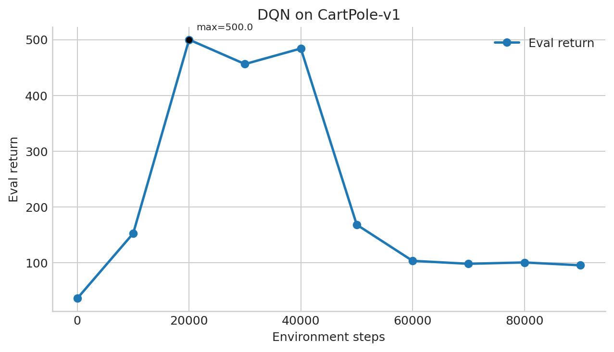
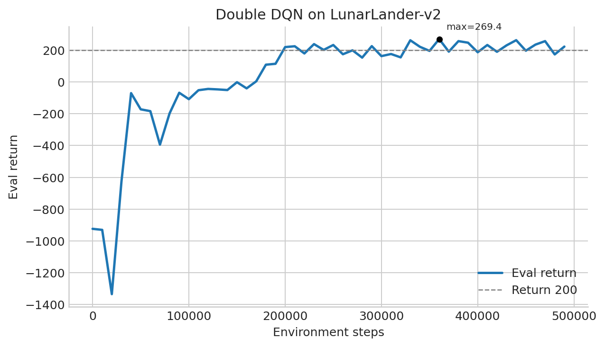
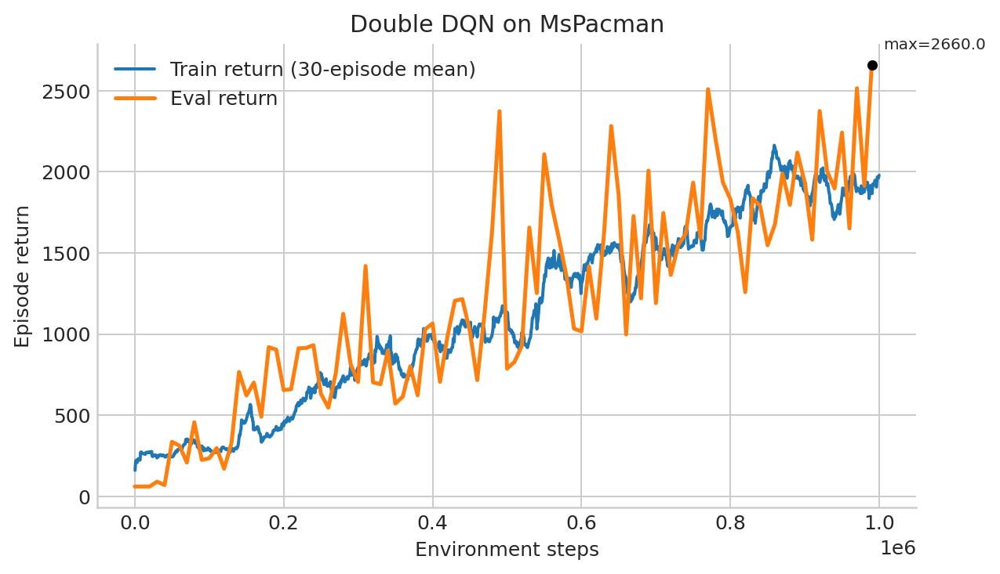
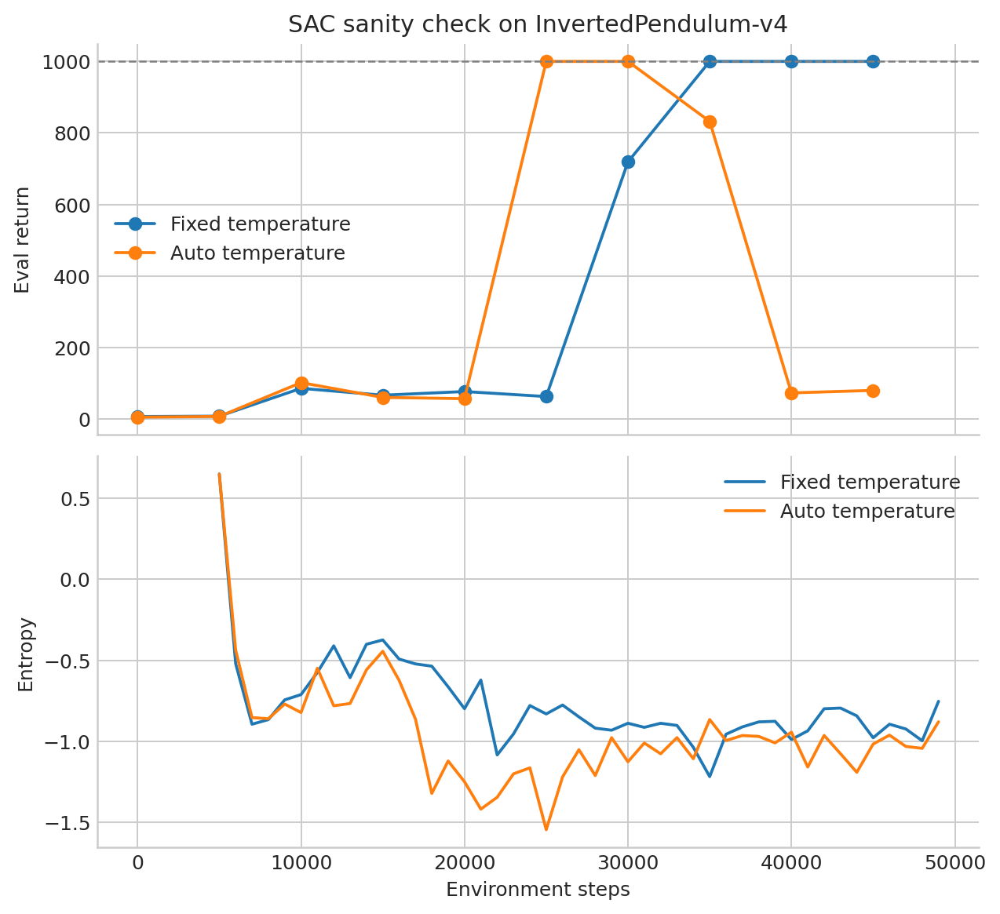
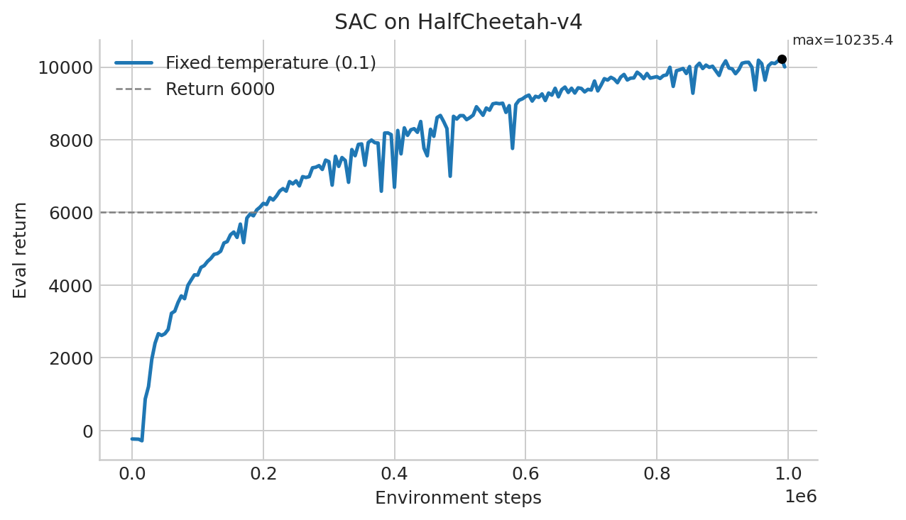
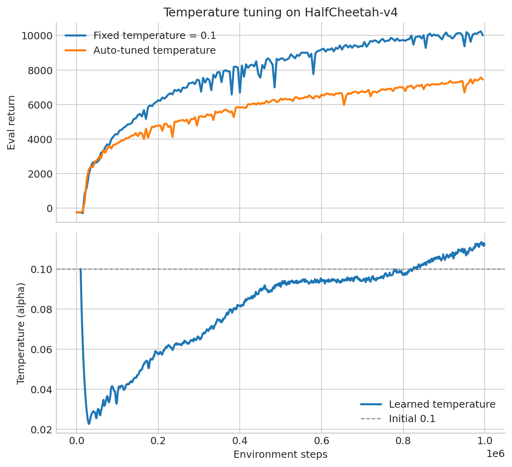
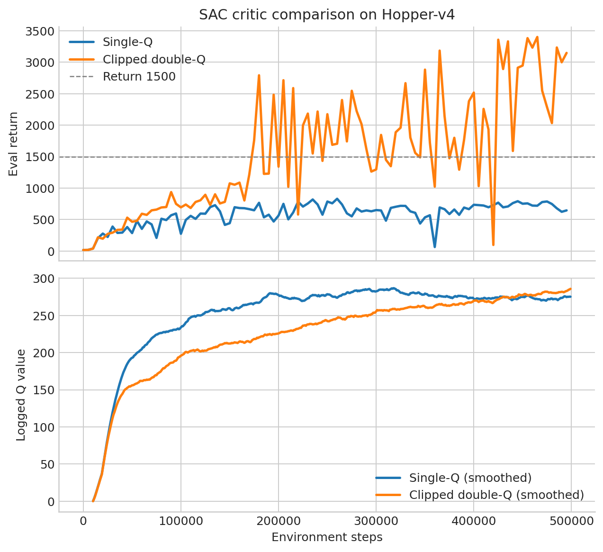

# CS285 HW3 实验报告：Q-Learning 与 Actor-Critic

## 1. 实验说明

本次作业实现并测试了面向离散动作空间的 Deep Q-Network（DQN）与面向连续动作空间的 Soft Actor-Critic（SAC）。实验均使用 `seed=1`，报告结果取自 `exp/` 目录中的本地日志。按照作业说明，本报告展示单次最佳运行；严格的强化学习研究通常还应报告多个随机种子的均值与方差。

主要实现文件如下：

- `src/agents/dqn_agent.py`：DQN、目标网络、Double DQN 与 ε-greedy。
- `src/scripts/run_dqn.py`：DQN 环境交互、replay buffer 采样与训练循环。
- `src/agents/sac_agent.py`：SAC critic、Actor、熵奖励、自动温度和 clipped double-Q。
- `src/scripts/run_sac.py`：SAC 环境交互、replay buffer 与更新循环。

## 2. Deep Q-Learning

### 2.1 Basic DQN（Section 2.4）

DQN 使用在线网络 $Q_\phi(s,a)$ 预测离散动作的价值，并使用目标网络 $Q_{\phi'}$ 构造 Bellman target：

$$
y=r+\gamma(1-d)\max_{a'}Q_{\phi'}(s',a').
$$

在线网络通过最小化均方误差更新：

$$
L_Q(\phi)=\mathbb E\left[\left(Q_\phi(s,a)-y\right)^2\right].
$$

环境交互使用 ε-greedy：以概率 ε 随机探索，否则选择当前 Q 值最大的动作。训练数据保存在 replay buffer 中，随机采样能够降低相邻 transition 的相关性；目标网络定期复制在线网络参数，使监督目标变化更平缓。

#### CartPole-v1 结果



CartPole 的评估回报在 20,000 步达到 500，满足作业“训练期间至少达到一次 500”的要求。之后回报明显下降，90,000 步时约为 95.4。对应日志中后期出现较大的 critic loss 和梯度范数尖峰，而 Q 值仍持续上升。这体现了 DQN 中函数逼近、bootstrap 和 off-policy 数据共同引起的不稳定性：网络能够继续拟合移动的 Bellman target，但动作之间的相对 Q 值排序可能被破坏。

该现象也说明“曾经达到最优回报”并不意味着继续训练一定会保持最优策略。实践中应使用多随机种子、定期评估、保存最佳 checkpoint，并考虑 Double DQN、梯度裁剪或更保守的学习率。

### 2.2 Double DQN（Section 2.5）

普通 DQN 使用同一个目标网络完成“选择动作”和“评价动作”，容易产生过度估计。Double DQN 将两步分离：

$$
a^*=\arg\max_{a'}Q_\phi(s',a'),
$$

$$
y=r+\gamma(1-d)Q_{\phi'}(s',a^*).
$$

在线网络负责选择下一动作，目标网络只负责评价该动作，从而降低最大化操作带来的正偏差。

#### LunarLander-v2 结果



LunarLander 的最高评估回报为 269.45，出现在约 360,000 步；最终评估回报为 222.12。最高值超过作业要求的 200，说明 Double DQN 已经学会稳定降落。训练早期回报最低约为 -1334，表明随机探索和不准确的初始 Q 估计会产生大量失败轨迹；随着 replay buffer 中有效经验增多，策略逐渐跨过 200 分门槛。

#### MsPacman 结果



MsPacman 的最高评估回报为 2660，最终评估回报同样为 2660，高于作业要求的约 1500。单个训练 episode 的最高回报为 4860；图中的训练曲线使用 30 个 episode 的滑动平均，以减小单局游戏随机性的影响。

训练回报和评估回报在早期存在明显差异，主要有三个原因：

1. 训练策略使用非零 ε，会主动执行随机动作；评估时使用 ε=0 的贪心策略，因此评估通常更能反映当前 Q 网络的确定性表现。
2. 训练回报来自不断变化的数据收集策略，而评估回报是在固定评估阶段对多条轨迹求平均，两者统计口径不同。
3. Atari 的图像状态、帧堆叠和较长时域使单个 episode 方差较大，训练曲线因此比评估均值更噪声化。

### 2.3 超参数敏感性（Section 2.6，定性分析）

本节按要求不新增超参数扫描实验，因此不报告虚构曲线。这里选择学习率作为分析对象，因为 CartPole 日志已经表现出后期梯度尖峰和策略坍塌，说明 DQN 对更新步长较敏感。

若在 LunarLander 上比较学习率 $\{10^{-4},2.5\times10^{-4},5\times10^{-4},10^{-3}\}$，预期现象如下：

| 学习率 | 预期现象 |
|---|---|
| $10^{-4}$ | 更新稳定但收敛较慢，有限训练步数内可能尚未达到 200 |
| $2.5\times10^{-4}$ | 稳定性与学习速度较平衡 |
| $5\times10^{-4}$ | 当前配置，能够达到较好回报，但仍可能出现波动 |
| $10^{-3}$ | 学习初期较快，但 Bellman target 与在线网络同时快速变化，可能导致 loss 和 Q 值振荡 |

学习率过小会造成欠训练，过大则会放大 bootstrap target 的误差。更严谨的结论需要保持其他配置与随机种子不变，实际运行四组实验并绘制同轴曲线。

## 3. Soft Actor-Critic

### 3.1 SAC 总体目标

连续动作无法像 DQN 一样枚举并计算 $\arg\max_a Q(s,a)$，因此 SAC 同时学习随机策略 $\pi_\theta(a|s)$ 和状态动作价值函数 $Q_\phi(s,a)$。SAC 最大化奖励与策略熵之和：

$$
J(\pi)=\mathbb E\left[\sum_t\gamma^t\left(r_t+\alpha\mathcal H(\pi(\cdot|s_t))\right)\right].
$$

熵奖励能够维持探索，减少策略过早集中在次优动作上的风险。Actor 输出 tanh-squashed Gaussian 分布，使动作自然落在 $[-1,1]$ 内，再由环境 wrapper 映射到真实动作范围。

### 3.2 Bootstrapped Critic（Section 3.2）

SAC critic 的基础 target 为：

$$
y=r+\gamma(1-d)Q_{\phi'}(s',a'),\qquad a'\sim\pi_\theta(\cdot|s').
$$

在线 critic 最小化：

$$
L_Q=\mathbb E[(Q_\phi(s,a)-y)^2].
$$

目标网络支持 hard update 和 soft update。主要实验使用 Polyak averaging：

$$
\phi'\leftarrow(1-\tau)\phi'+\tau\phi,
$$

其中 $\tau=0.005$。这种小步更新避免 target critic 突然跳变。

### 3.3 熵奖励（Section 3.3）

策略熵使用单样本 Monte Carlo 估计：

$$
\hat{\mathcal H}(\pi(\cdot|s))=-\log\pi(a|s),\qquad a\sim\pi(\cdot|s).
$$

加入熵之后，soft Bellman target 为：

$$
y=r+\gamma(1-d)\left[Q_{\phi'}(s',a')-\alpha\log\pi(a'|s')\right].
$$

Actor loss 则为：

$$
L_\pi=\mathbb E[\alpha\log\pi(a|s)-Q_\phi(s,a)].
$$



在 InvertedPendulum 的固定温度运行中，早期记录的熵约为 0.649，接近一维 tanh 动作空间的最大熵 $\log2\approx0.693$，说明熵估计和符号方向合理。完成 Actor 的 Q 最大化目标后，策略会为保持平衡而逐渐集中，微分熵可以下降为负值，这是连续分布中的正常现象。

固定温度 SAC 在约 35,000 步达到 1000，并在最终评估中保持 1000。自动温度版本也曾在约 25,000 步达到 1000，但最终一次评估下降到 80.3，说明单次随机策略评估仍可能存在显著波动。

### 3.4 重参数化 Actor 更新（Section 3.4）

为了让梯度穿过随机动作，使用：

$$
\epsilon\sim\mathcal N(0,I),
$$

$$
a=\tanh(\mu_\theta(s)+\sigma_\theta(s)\epsilon).
$$

PyTorch 的 `rsample()` 保留从 $Q(s,a)$ 经动作回到 Actor 参数的梯度，而普通 `sample()` 会切断这条路径。Actor 使用在线 critic 而非 target critic，因为策略应根据最新 Q 估计进行改善。

本次不新增 Section 3.4 扩展实验，但使用已经完成的固定温度 HalfCheetah 日志报告基础结果：



固定温度 $\alpha=0.1$ 的 SAC 在约 990,000 步达到最高评估回报 10235.37，最终评估回报为 10006.48，显著超过作业要求的 6000。曲线说明重参数化梯度能够有效训练连续控制策略。

### 3.5 Automatic Temperature Tuning

自动温度调节把熵下界写成约束，并将 $\alpha$ 视为拉格朗日乘子。为保证 $\alpha>0$，使用：

$$
\alpha=\exp(\log\alpha).
$$

常用的 dual loss 为：

$$
L_\alpha=-\mathbb E\left[\log\alpha\left(\log\pi(a|s)+\mathcal H_{\text{target}}\right)\right],
$$

其中 $\mathcal H_{\text{target}}=-\dim(\mathcal A)$。当当前熵低于目标时，$\alpha$ 增大以加强探索；当前熵高于目标时，$\alpha$ 减小以更重视 Q 值。



固定温度运行最高回报为 10235.37，自动温度运行最高回报为 7565.72，最终分别为 10006.48 和 7446.39。因此自动温度没有超过已经良好调节的固定温度 0.1，但仍超过 6000，属于可用且具有竞争力的结果。这符合题目提示：自动调节的主要优势是免去在新环境中人工搜索温度，而不是保证超过最佳手调值。

自动温度从 0.1 开始，早期最低下降到约 0.0227，随后逐渐回升，后期稳定在约 0.112，最高约 0.113。可能的解释是：

1. 训练初期策略自身熵较高，算法降低 $\alpha$，使 Actor 更快关注回报。
2. 随着 HalfCheetah 策略逐渐集中到稳定步态，熵低于目标，$\alpha$ 再次升高以维持动作多样性。
3. 后期温度接近初始 0.1，侧面说明默认固定温度本身已经较适合该环境。

### 3.6 Clipped Double-Q

使用两个在线 critics 与两个 target critics，并采用保守 target：

$$
Q_{\text{backup}}(s',a')=min\left(Q_{\phi'_1}(s',a'),Q_{\phi'_2}(s',a')\right).
$$

两个在线 critic 使用相同的 target：

$$
y_1=y_2=r+\gamma(1-d)\left[Q_{\text{backup}}(s',a')-\alpha\log\pi(a'|s')\right].
$$



Hopper 实验结果如下：

| 方法 | 最高 Eval Return | 最终 Eval Return | 最终 Logged Q |
|---|---:|---:|---:|
| Single-Q | 830.16 | 645.63 | 277.02 |
| Clipped double-Q | 3399.56 | 3146.50 | 288.54 |

Clipped double-Q 显著优于 single-Q，并超过作业要求的 1500。虽然两次运行后期记录的 Q 值数量级接近，不能简单地认为“Q 更低就一定更保守”，因为两个策略访问的状态动作分布已经完全不同：clipped double-Q 策略获得了更高回报，因此访问的状态本身也可能具有更高真实价值。

更有意义的现象是，single-Q 在只有约 646 最终评估回报时仍报告约 277 的平均 Q，而 clipped double-Q 在约 3147 回报下报告约 289 的平均 Q。single-Q 的 Q 估计与实际策略质量之间更不匹配，符合过度估计或误校准会误导 Actor 的解释；取两个 target Q 的最小值减少了正偏差，使 Actor 得到更可靠的优化方向。

## 4. 总结

| 实验 | 最高评估回报 | 作业参考要求 | 结果 |
|---|---:|---:|---|
| CartPole DQN | 500.00 | 500 | 达到 |
| LunarLander Double DQN | 269.45 | 200 | 超过 |
| MsPacman Double DQN | 2660.00 | 约 1500 | 超过 |
| HalfCheetah SAC，固定温度 | 10235.37 | 6000 | 超过 |
| HalfCheetah SAC，自动温度 | 7565.72 | 6000 | 超过 |
| Hopper clipped double-Q | 3399.56 | 1500 | 超过 |

总体而言，DQN 能够解决离散动作任务，但表现出明显的训练不稳定性；Double DQN 通过分离动作选择与评价降低过度估计。SAC 通过随机 Actor、熵正则化与重参数化处理连续动作；soft target update、自动温度和 clipped double-Q 分别改善了 target 稳定性、探索系数选择和 Q 过度估计问题。实验中固定温度 HalfCheetah 优于自动温度，而 Hopper 上 clipped double-Q 显著优于 single-Q，说明不同稳定化机制的收益与环境和已有超参数质量密切相关。

## 5. 复现实验命令

```bash
uv run src/scripts/run_dqn.py -cfg experiments/dqn/cartpole.yaml --eval_interval 2500
uv run src/scripts/run_dqn.py -cfg experiments/dqn/lunarlander.yaml
uv run src/scripts/run_dqn.py -cfg experiments/dqn/mspacman.yaml

uv run src/scripts/run_sac.py -cfg experiments/sac/sanity_invertedpendulum.yaml
uv run src/scripts/run_sac.py -cfg experiments/sac/halfcheetah.yaml
uv run src/scripts/run_sac.py -cfg experiments/sac/halfcheetah_autotune.yaml
uv run src/scripts/run_sac.py -cfg experiments/sac/hopper_singleq.yaml
uv run src/scripts/run_sac.py -cfg experiments/sac/hopper_clipq.yaml
```

在指定物理 GPU 6 时，可以在命令前添加：

```bash
CUDA_VISIBLE_DEVICES=6
```

同时将脚本参数设为 `--which_gpu 0`。
